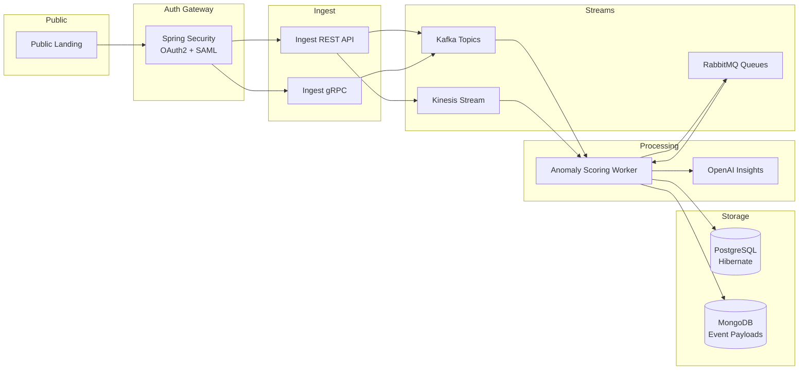
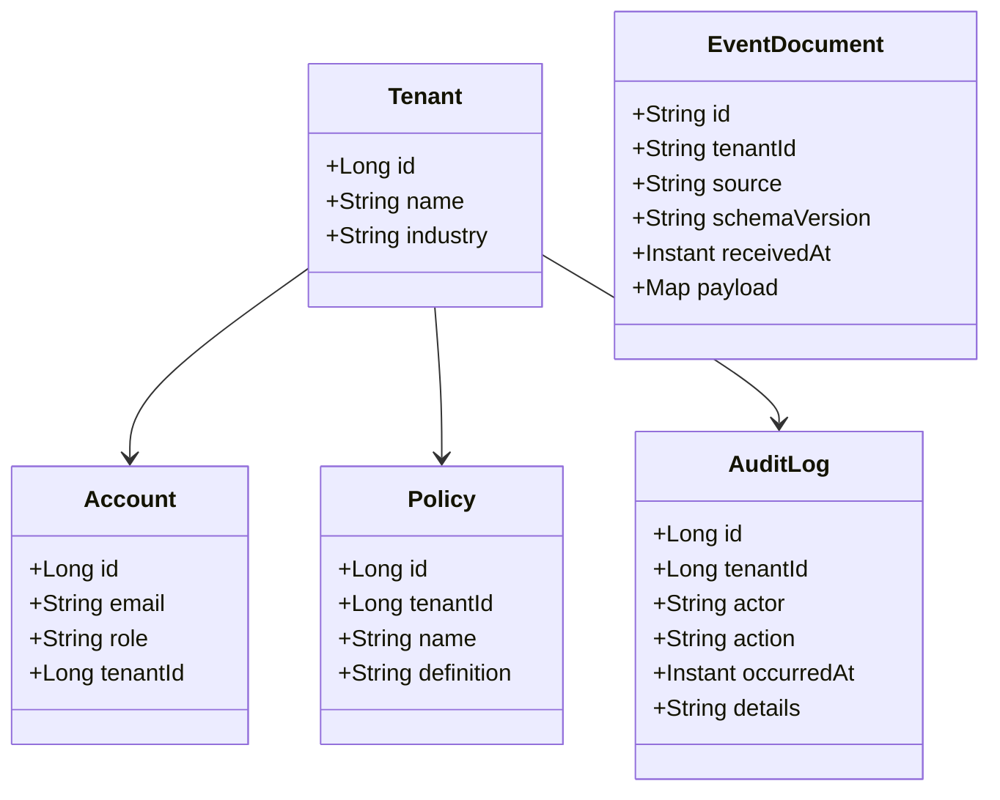
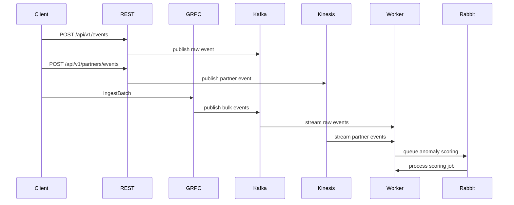
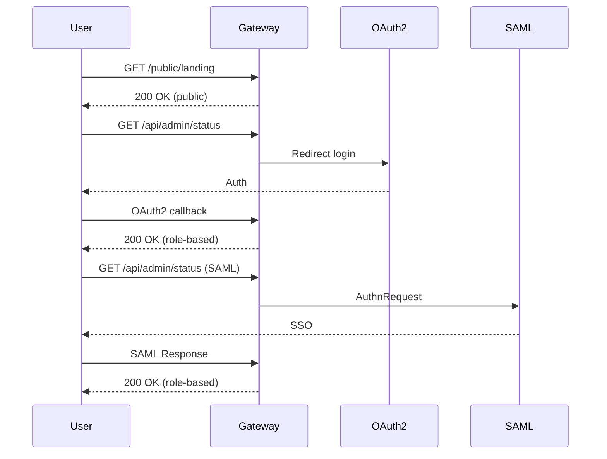

# DataTrust360 UML (Mermaid)

## System Architecture

```mermaid
flowchart LR
  subgraph Public
    Landing[Public Landing]
  end

  subgraph Auth[Auth Gateway]
    AGW[Spring Security
OAuth2 + SAML]
  end

  subgraph Ingest
    REST[Ingest REST API]
    GRPC[Ingest gRPC]
  end

  subgraph Streams
    KAFKA[Kafka Topics]
    KINESIS[Kinesis Stream]
    RABBIT[RabbitMQ Queues]
  end

  subgraph Storage
    SQL[(PostgreSQL
Hibernate)]
    NOSQL[(MongoDB
Event Payloads)]
  end

  subgraph Processing
    WORKER[Anomaly Scoring Worker]
    INSIGHTS[OpenAI Insights]
  end

  Landing --> AGW
  AGW --> REST
  AGW --> GRPC
  REST --> KAFKA
  REST --> KINESIS
  GRPC --> KAFKA
  KAFKA --> WORKER
  KINESIS --> WORKER
  WORKER --> RABBIT
  RABBIT --> WORKER
  WORKER --> SQL
  WORKER --> NOSQL
  WORKER --> INSIGHTS
```

## Domain Model

```mermaid
classDiagram
  class Tenant {
    +Long id
    +String name
    +String industry
  }
  class Account {
    +Long id
    +String email
    +String role
    +Long tenantId
  }
  class Policy {
    +Long id
    +Long tenantId
    +String name
    +String definition
  }
  class AuditLog {
    +Long id
    +Long tenantId
    +String actor
    +String action
    +Instant occurredAt
    +String details
  }
  class EventDocument {
    +String id
    +String tenantId
    +String source
    +String schemaVersion
    +Instant receivedAt
    +Map payload
  }

  Tenant --> Account
  Tenant --> Policy
  Tenant --> AuditLog
```

## Ingestion Pipeline

```mermaid
sequenceDiagram
  participant Client
  participant REST
  participant GRPC
  participant Kafka
  participant Kinesis
  participant Worker
  participant Rabbit

  Client->>REST: POST /api/v1/events
  REST->>Kafka: publish raw event
  Client->>REST: POST /api/v1/partners/events
  REST->>Kinesis: publish partner event
  Client->>GRPC: IngestBatch
  GRPC->>Kafka: publish bulk events
  Kafka->>Worker: stream raw events
  Kinesis->>Worker: stream partner events
  Worker->>Rabbit: queue anomaly scoring
  Rabbit->>Worker: process scoring job
```

## Authentication Flow

```mermaid
sequenceDiagram
  participant User
  participant Gateway
  participant OAuth2
  participant SAML

  User->>Gateway: GET /public/landing
  Gateway-->>User: 200 OK (public)
  User->>Gateway: GET /api/admin/status
  Gateway->>OAuth2: Redirect login
  OAuth2-->>User: Auth
  User->>Gateway: OAuth2 callback
  Gateway-->>User: 200 OK (role-based)

  User->>Gateway: GET /api/admin/status (SAML)
  Gateway->>SAML: AuthnRequest
  SAML-->>User: SSO
  User->>Gateway: SAML Response
  Gateway-->>User: 200 OK (role-based)
```
